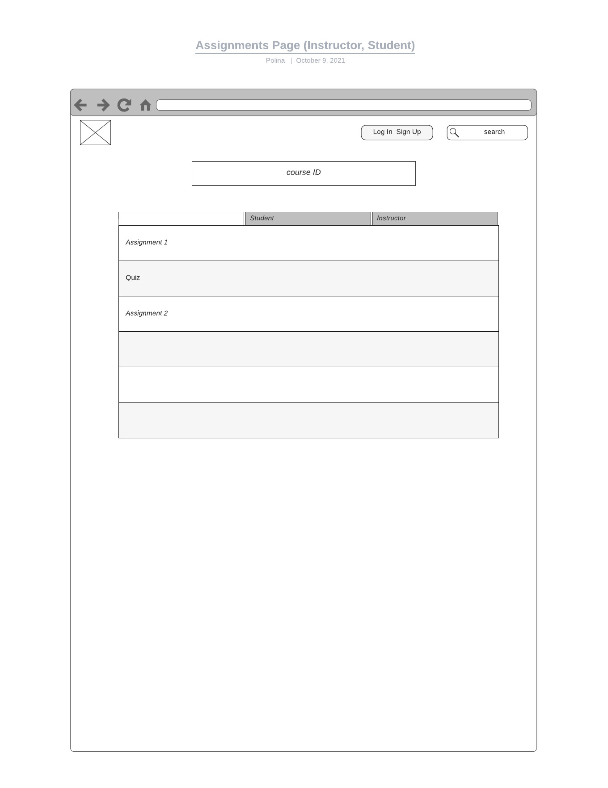
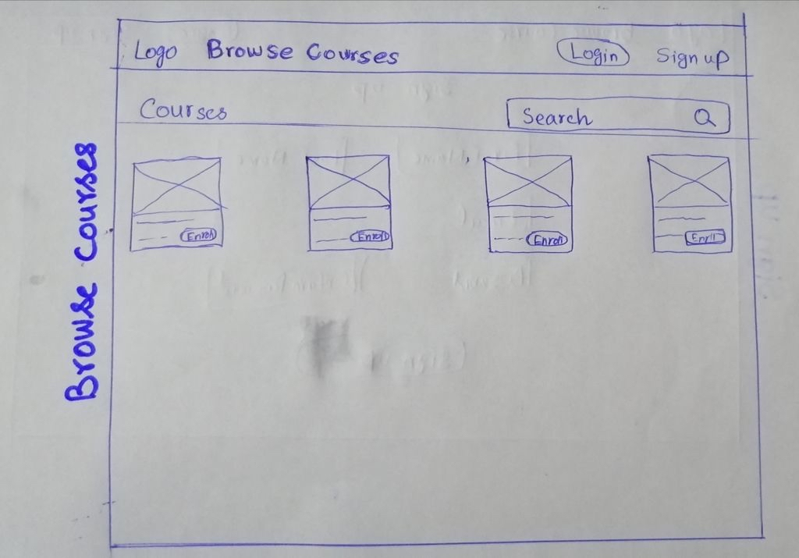

# chalkboard
## sitemap 

<!--

-->

Homepage
   * Sign Up and Log In
      * Sign Up
      * Log In
         * DashBoard
            * Courses
               * Course
                  * Instructors
                  * Roster
                     * Content
                     * Grades
                     * Description
                     * Name
                     * Assignements
                  * Sequenced Courese
            * Courses
               * Course
                  * Enroll
                     * Assignments
                        * Assignment
                           * Due Date
                           * Submit
                           * Description
                           * Upload
                           * Write
                           * Save
                     * Content
                     * Grades
                  * Drop
                  * WaitList
            * Courses
               * Course
                  * Delete Course
                  * Leave Course 
                  * Add Instructors
                  * Add Course
                     * Assignments
                        * Assignment
                           * Upload
                           * Grade
                           * Feedback
                           * DueDate
                     * Grades
                     * Content
                  * Roster
         * Form                  
   * LOGO
   * Locations
      * Map 

<!---->

This is good pratice for making a web-site in line with stakeholder requirements.I expanded on the first(and may be final) draft of wireframes and sitemap, and the markdown.

Homepage
   * Browse Courses
      * Search
      * All courses
      * Serach filter
   * Log In
      * Student
         * Browse Courses
            * Course Description
            * Request for enrollment
         * DashBoard
            * Pending Assignment
            * Enrolled Courses
               * Course Materials
               * Lecture Videos
               * Assignments
      * Instructor
         * Request for access
         * DashBoard
            * New Course
               * Fill the information
            * Number of courses teaching
               * Remove, uodate
               * Roster of students     
                  
