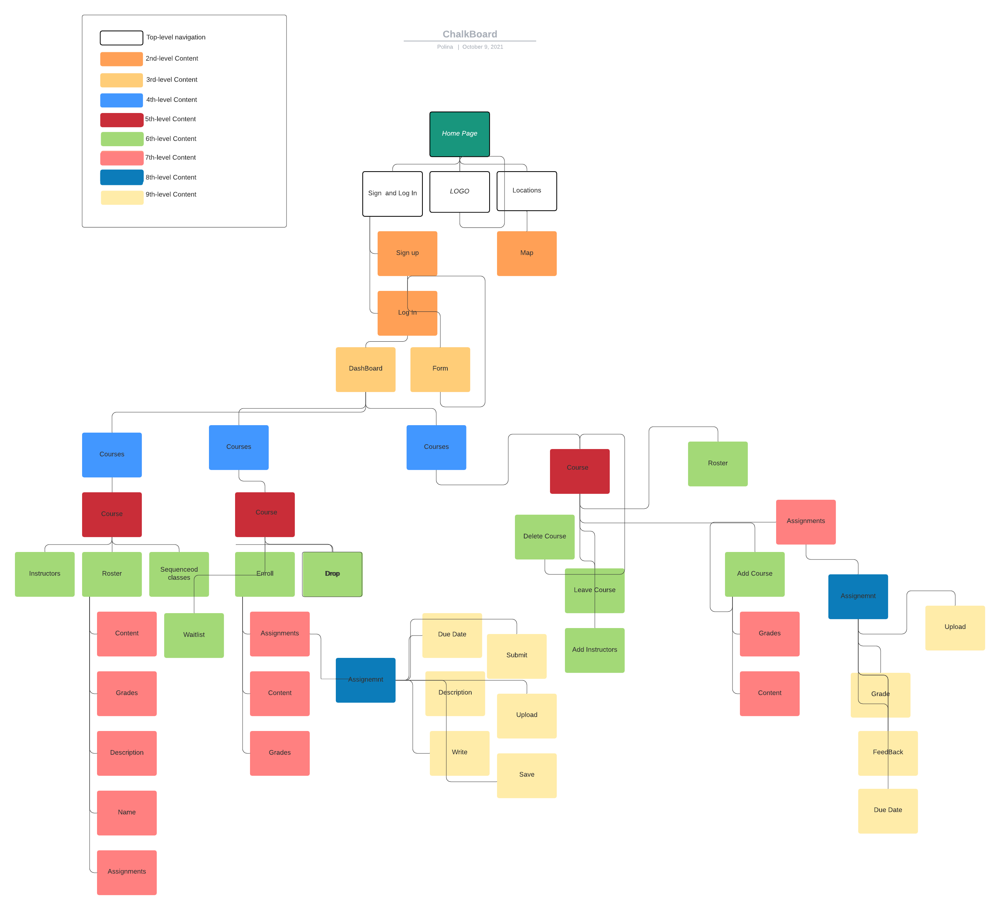
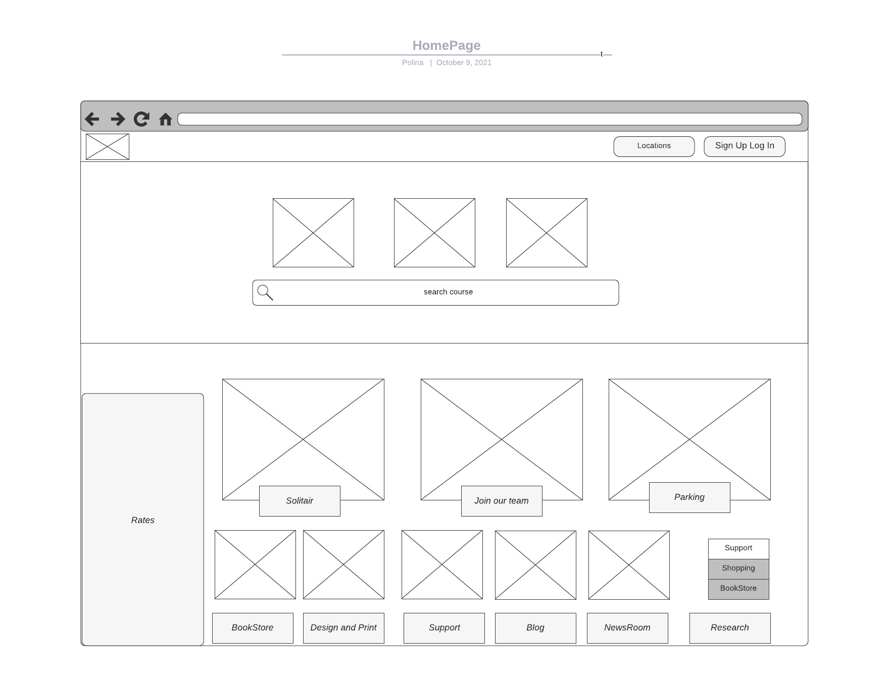
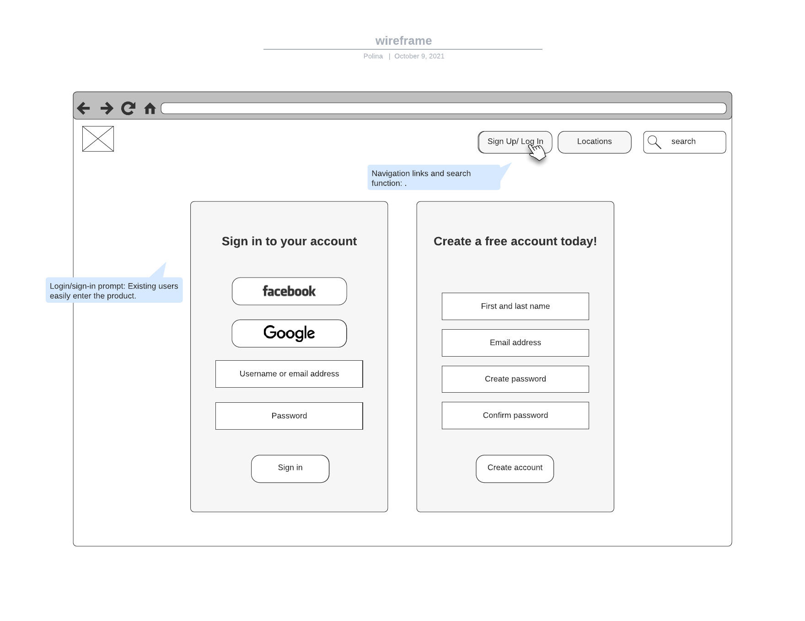
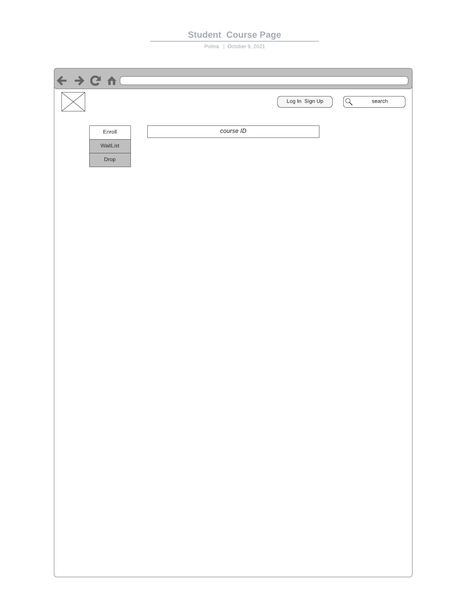
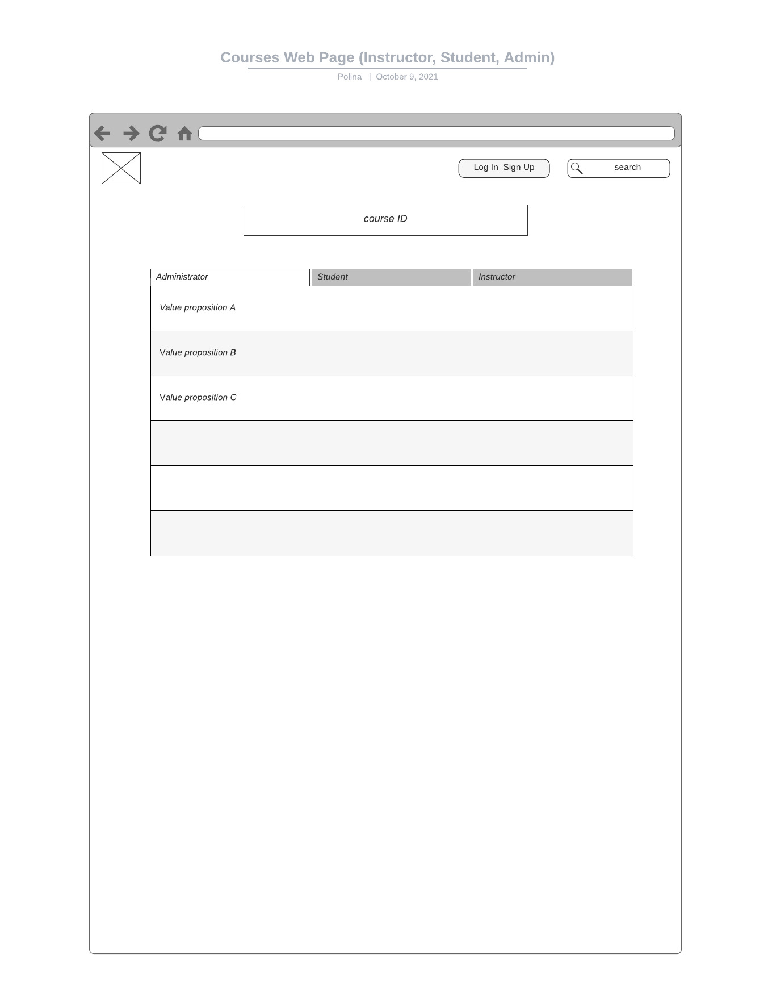
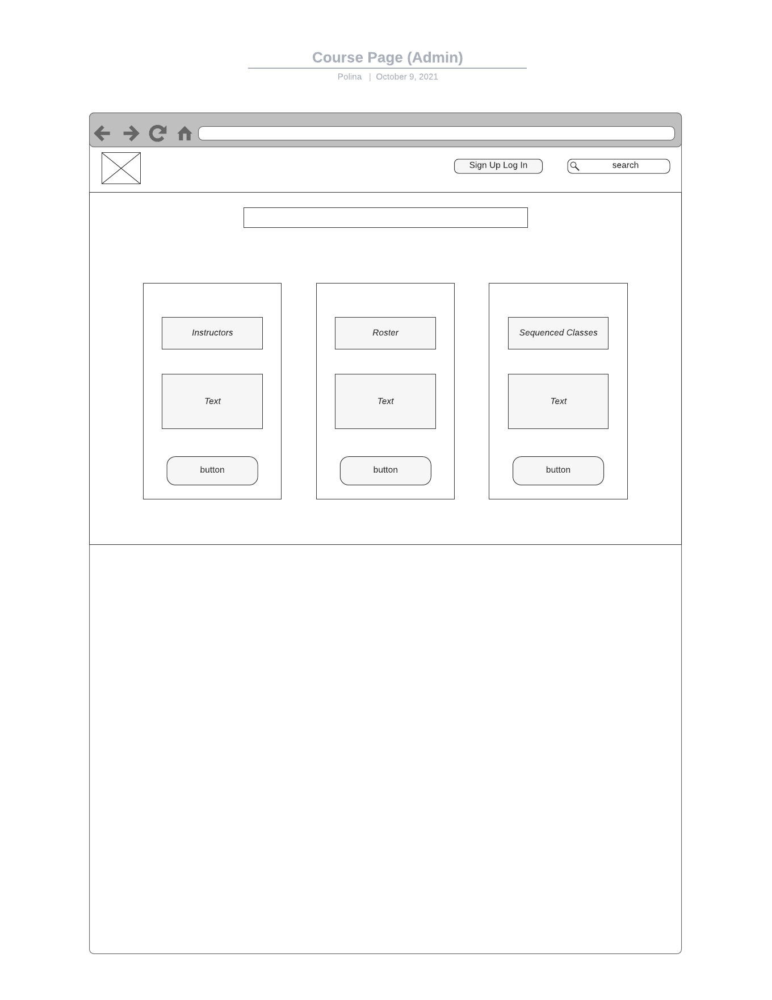
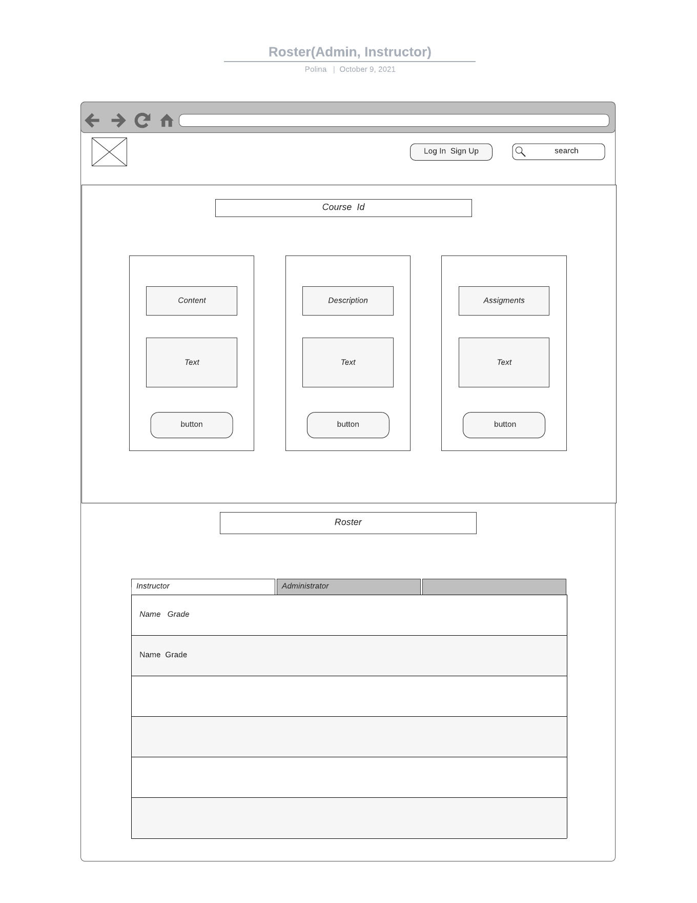
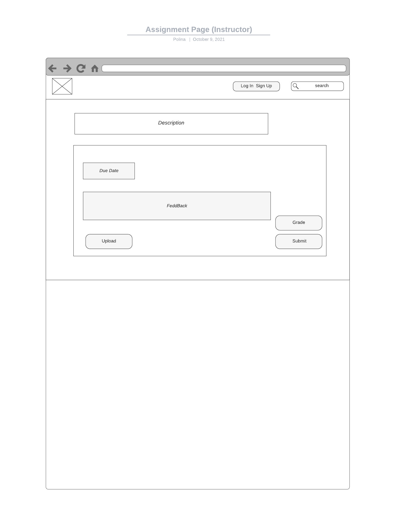

# chalkboard
## sitemap 

<!--

-->

Homepage
   * Sign Up and Log In
      * Sign Up
      * Log In
         * DashBoard
            * Courses
               * Course
                  * Instructors
                  * Roster
                     * Content
                     * Grades
                     * Description
                     * Name
                     * Assignements
                  * Sequenced Courese
            * Courses
               * Course
                  * Enroll
                     * Assignments
                        * Assignment
                           * Due Date
                           * Submit
                           * Description
                           * Upload
                           * Write
                           * Save
                     * Content
                     * Grades
                  * Drop
                  * WaitList
            * Courses
               * Course
                  * Delete Course
                  * Leave Course 
                  * Add Instructors
                  * Add Course
                     * Assignments
                        * Assignment
                           * Upload
                           * Grade
                           * Feedback
                           * DueDate
                     * Grades
                     * Content
                  * Roster
         * Form                  
   * LOGO
   * Locations
      * Map 

